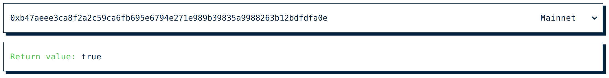

# Revert Reason

[republicprotocol.github.io/renhack-revert-reason](https://republicprotocol.github.io/renhack-revert-reason)

Retrieves the return value or revert message of a transaction.

If the source code is available from Etherscan, it decodes return values and shows the source code for reverts.

## Updating

Before committing, update `./public/commitHash.json` with the latest commit hash.

After committing, run `npm run deploy`.

## Preview

Revert reason:

Return value:

## TXs for testing

* Mainnet: `0x90f676dc7e606c50db55fcd8c5c7f85b4d4491fc534c6f6b1004cb4ea2997bfd`
* Kovan: `0x7e07712e0dd60e2914889e2ebd3acaaaa76739e0ca5d03517db55152817f8a99`